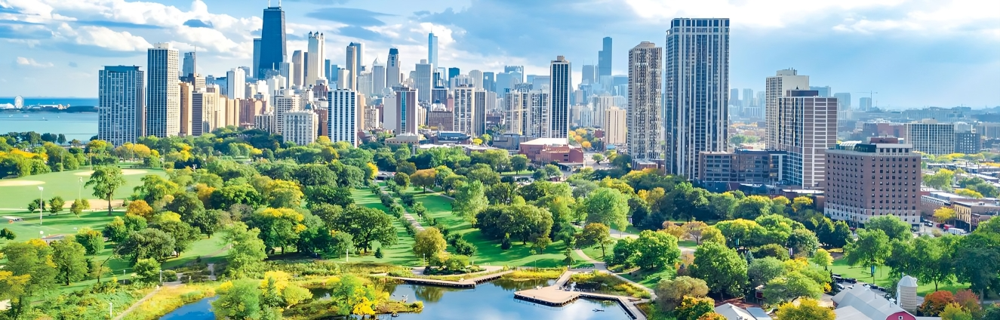

# Building Greener Cities: Utilizing Geospatial Data for Sustainable Urban Planning

Welcome to the repository for "Building Greener Cities," which explores the potential of geospatial data for sustainable urban planning in Delhi, India.

## Embark on a Journey through Sustainable Urban Planning:

This project leverages the power of geospatial data and storytelling to address pressing environmental challenges in Delhi. Let's delve into the details:

## Explore the StoryMap:

Direct Link: https://arcg.is/1X85q02

QR Code: Scan the QR code below (or download the image file: story_map_qr.png) to access the StoryMap directly from your mobile device!

## Infographic Poster:

Dive deeper into the key findings and research conclusions with our visually compelling infographic poster:

infographic_poster.pdf: [View Infographic Poster](Naman_infographic_Poster.pdf)

## Abstract Report:

For a detailed overview of the research methodology, findings, and recommendations, refer to the abstract report:

abstract_report.pdf: [View Abstract Report](Abstract_Report.pdf)

## Let's Build a Greener Future!

This project demonstrates the transformative power of geospatial data in tackling urban sustainability challenges. We invite you to explore the resources provided and share your feedback.

Keywords: geospatial data, sustainable urban planning, air quality analysis, flood risk assessment, rainwater harvesting, PM2.5, spatial statistics, overlay analysis, GIS, ArcGIS StoryMaps, remote sensing, urban planning
